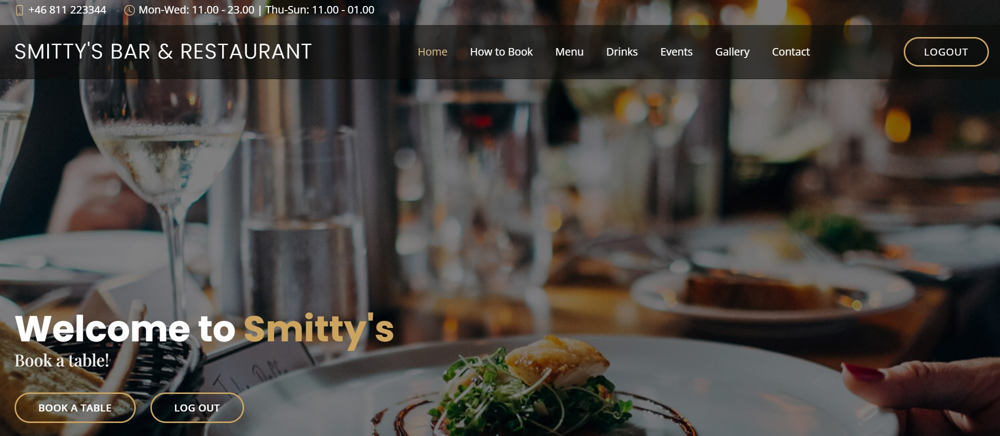
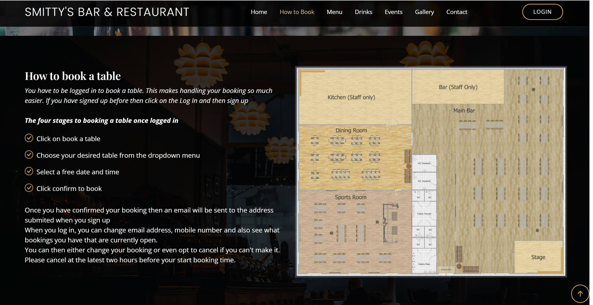
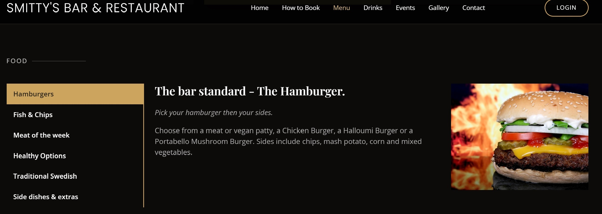
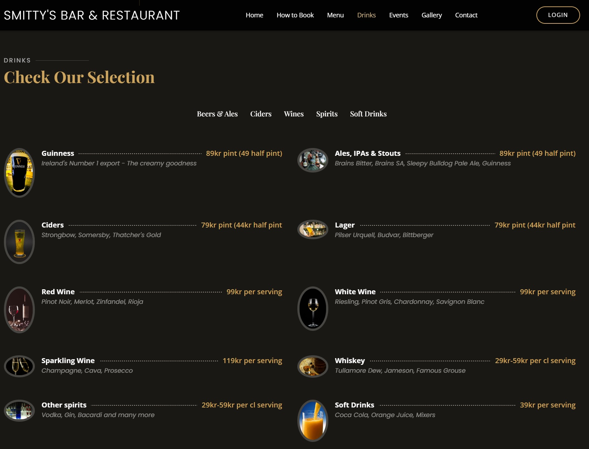
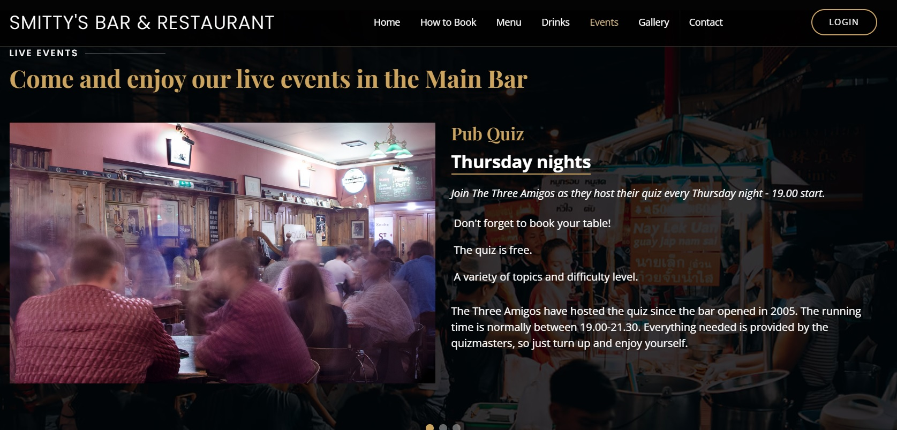
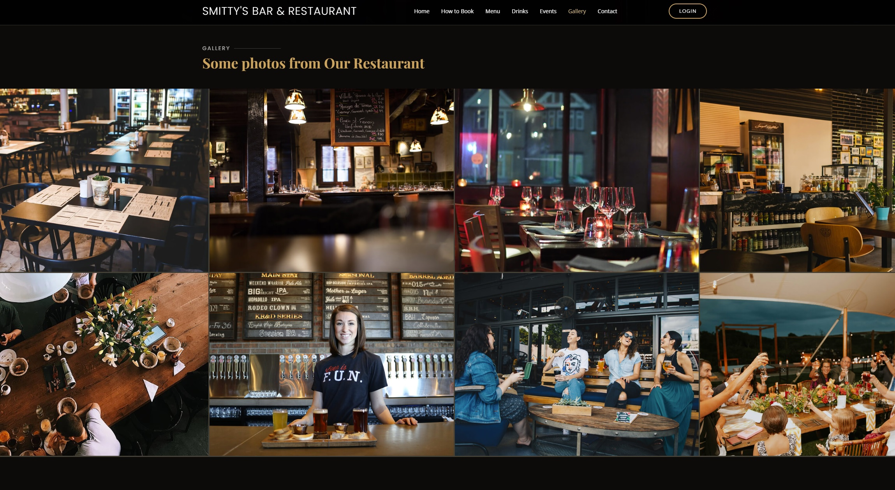
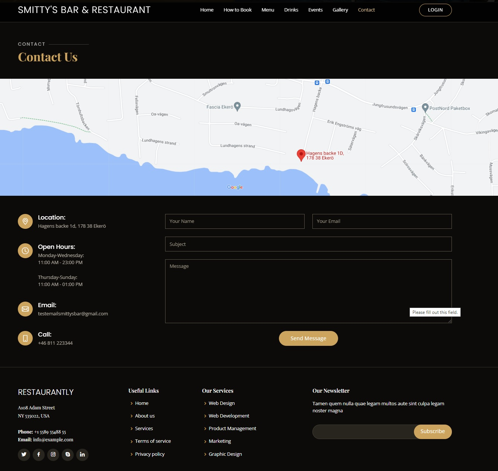
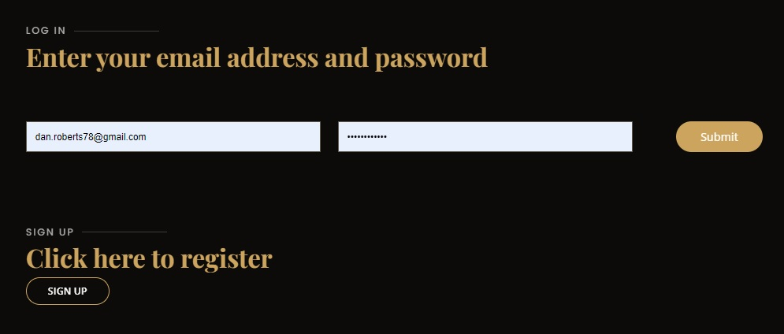

# Smitty's Bar & Restaurant aka - A lesson in time-management, project-planning and sticking to the basics

This project was bootstrapped using the Restaurantly website template available from <https://bootstrapmade.com/restaurantly-restaurant-template/>
and powered by the Cross Platform Cloud IDE called Codeanywhere <https://app.codeanywhere.com/>

## Includes

- Layout and Navigation
- Programs and tools
- Bugs, missing parts and issues
- My feedback
- Links, references and credits

The initial aim of this website was to provide a website to a fictional bar that included log/sign in/out functions and could utilise the inbuilt admin tool of Django and the database functions of PostgreSQL.

This is a website and so the only thing needed would be to sign up and log in.

### Layout and Navigation

The website has 4 navigational pages:

| 'html' Page Name         |          Accessed how?          |
| ------------------------ | :-----------------------------: |
| 'index' Home             | Loading homepage, 'logging out' |
| 'login' Login            |   Clicking on 'log in' button   |
| 'signup' Sign Up         |  Clicking on 'sign up' button   |
| 'booktable' Book-a-table | Clicking on 'Book table' button |

#### The html pages

##### Homepage start up screen

This is the first screen upon opening the website. The homepage can also be accessed at any time by clicking on "SMITTY'S BAR & RESTAURANT" located to the left of the the links. It can be scrolled down and also has working links found across the top of the header.

These links are:

- Home
- How to book
- Menu
- Drinks
- Events
- Gallery
- Contact

##### Home "hero section"

This part of the webpage shows two buttons that change depending on whether the user is logged in or not.

This is the page in its default position. Before logging in, the user can either choose to log in or sign up:

And this is the page after logging in, the user can now access the "Book a Table" page or choose to log out:

##### Other links on main page

The following links on the page are seen as follows:

How to Book:

Menu:

Drinks:

Events:

Gallery:

Contact Us:

#### Other html pages

##### Sign in page

This page is accessed through the "Sign Up" button and then the aim was that upon entering the nesessary details, the user would have their details registered to the admin part of django and then the user would be logged in(see bugs):

##### Log in page

The aim here was that this should have been accessed through the "Log In" button and then entering a previously registered email address and password, the user would be logged in(see bugs):

---

## Programs and tools

#### Programs

The following have been used during this website:

- Django
- Python
- JavaScript (Bootstrap only)
- HTML
- CSS

What should have also been used but wasn't (see problems):

- PSQL

#### Tools

The following have been used during this website:

- Bootstrap

#### Log in profiles and profiles used during production

Superuser:
username: admin
email: admin@email.com
Password: September:2023

Email Smittys Bar:
email: testemailsmittysbar@gmail.com
password: SmittysBar:2023

Test User:
dave@daveemail.com / Dave / Davis / Thursday:2023

---

## Bugs, missing parts and issues

There are sadly many bugs, issues and missing parts to this website.

#### Bugs

- Upon entering login email and password, the html pages doesn't log the user in.
- Upon entering signing in email and password, there is an error code
- Message function is created and the code is added to the 'base.html' file but it does not load.

#### Missing Parts

There are many missing parts to the website:

- PSQL database function not created
- PSQL database tables not created
- Table booking function on 'booktable.html' not created
- The Contact US form is not connected

#### Issues

- The style.css file contains code that is not used and maybe even isn't connected.
- There are styling inconsistencies on the 'login.html' page

---

## My feedback

#### My feedback

I can diplomatically say that this has been a challenge. I have learnt so much from the negative parts I've experienced during this project, to an almost life-changing level.
This project needed a simpler base bootstrap template, less time on the stylings and more time on the functionalities.

---

## Links, references and credits

#### Links and references

- \*Bootstrap template:
  Template Name: Restaurantly
  Template URL: <https://bootstrapmade.com/restaurantly-restaurant-template/>
  Link: <https://github.com/technext/restaurantly/releases/download/v1.0/Restaurantly.zip>
  Author: BootstrapMade.com
  License: <https://bootstrapmade.com/license/>

- Help installing allauth:
  Code with Stein <https://www.google.com/search?sca_esv=567555228&rlz=1C1CHBD_svSE1043SE1044&q=linking+django+allauth&tbm=vid&source=lnms&sa=X&ved=2ahUKEwjFjeKh9b2BAxUbRvEDHSdhA7MQ0pQJegQIChAB&biw=1536&bih=735&dpr=1.25#fpstate=ive&vld=cid:54078088>

- Pictures:
  Pixabay <https://pixabay.com/>

- Help with authentication upon login:
  djangoproject.com <https://docs.djangoproject.com/en/4.2/topics/auth/default/#auth-web-requests>

- Help with postgresql connection:
  Profile: "Pretty Printed" <https://www.youtube.com/watch?v=t6RbanOhna4>

- Youtube online guides and tutorials: Codemy.com

#### Credits

Mentor: Akshat Garg
Fiverr debugger: Haris (coodingmentore)

[connecting heroku and django](https://www.youtube.com/watch?v=UkokhawLKDU)
import django_heroku
from decouple import config
installed pipreqs to only use reqs that are necessary
installed piptools to combine

added datepicker using pip install django-bootstrap-datepicker-plus

models.py [datetime](https://stackoverflow.com/questions/2029295/django-datefield-default-options)
installing db in postgresql using Code Institute module [Database Management Systems](https://learn.codeinstitute.net/courses/course-v1:CodeInstitute+DB101+2021_T1/courseware/c0c31790fcf540539fd2bd3678b12406/87ffa16374c74c55b202724586a834c9/?child=last)
issues with migrations - Tutor Assistance (Holly) - migrations deleted and elephantsql database reset, then migrations rerun date 220124
NEW SUPERUSER: admin/Monday:123
Test users: Alan/Alans/alan@gmail.com/Alan:2024

