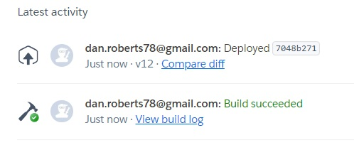

# Smitty's Bar & Restaurant

Bootstrapped using the Restaurantly website template available from <https://bootstrapmade.com/restaurantly-restaurant-template/>

Edited in the Cross Platform Cloud IDE Codeanywhere <https://app.codeanywhere.com/>

---------------

## Table of contents

1. The basics of Smitty’s 
    1.1 Brief introduction 
    1.2 Basic mechanics 
    1.3 Link to website 
2. Planning 
    2.1 Ideas and UX Design 
    2.2 User Stories 
3. Layout 
    3.1 Page Layout  
    3.2 Log in details 
    3.3 Programs and tools 
4. Important code functions 
    4.1 Python functions 
    4.2 Python start code 
5. Testing 
    5.1 Manual testing 
    5.2 Other tests 
6. Issues & Bugs 
    6.1 Resolved issues 
    6.2 Unresolved issues 
    6.3 Possible future developments 
7. Deployment 
    7.1 Heroku deployment 
    7.2 ElephantSQL creation 
8. Credits 
    8.1 Credits 
    8.2 References 
    8.3 Thanks 

-------------

## 1. The basics of Smitty's

#### 1.1 Brief introduction

The Smitty’s Bar & Restaurant website is a website for a fictitious bar that contains a login system and a booking system to store reservations. I designed the pub layout myself. Users can sign up, log in, book a table and look around at all that this pub has to offer.

#### 1.2 Basic mechanics

The website was created using the following:

- [Bootstrap framework Restaurantly](https://bootstrapmade.com/restaurantly-restaurant-template/) for the framework of the website
- [Django Python framework](https://www.djangoproject.com) as the progaming language
- [ElephantSQL](https://www.elephantsql.com/) for the connection to the database
- [Heroku](https://www.heroku.com) or the deployment of the website

#### 1.3 Link to the website

The website can be found [here](https://smittys-bd7d75f32e46.herokuapp.com/)

----------------

## 2. Planning

#### 2.1 Ideas and UX Design

**Ideas**

The thought process started with the suggestion of creating a booking system. I have experience of pub culture and so by being able to translate this idea into something I could relate to made the experience a lot more interesting, although maybe the attention to the visuals ended up being a lot greater than was needed. More attention to the functionality would’ve made this project a lot more enjoyable as I was progressing through.
Also with the bootstrap website being so advanced it actually made the process a lot harder. The more a customised, the more it created errors and bugs.

**UX Design**

This flowchart was created to show a simplified version of the main pages involved in the project

#### 2.2 User Stories

**Programmer**

- As a **programmer** I can **create a colour pattern and favicon for the website** to **make it pleasant for users**
- As a **programmer** I can **provide layout details and information to the user** to **help them make a choice and entice them to book a table**
- As a **programmer** I can **create a secure log in to the system** to **provide security of the details of the user**
- As a **programmer** I can **create a useful database** to **store information and provide it easily on the bookings of tables**

**Admin**

- As an **admin** I can **edit and check information** to **help with bookings and meet user demands**

User Stories not chosen:

- As a **user** I can **create an avatar** to **make my profile more fun**
- As a **user** I can **book multiple tables** to **make sure I can fit all my friends in**
- As a **user** I can **use the pub layout map to choose the table I want to sit at**so that I can **easily see what table suits my choice for my chosen time**

User Stories not closed:

- As a **programmer** I can **create a mailing system** to **keep the user/owners update with bookings and any changes/cancellations**
- As a **programmer** I can **create sufficient checks** to **enable the website to run without errors** (Manual checks were used instead of creating programmed checks)
- As a **programmer** I can **create an upcoming events page** so that I can **inform the user of what future events are happening at the pub**

-----------

## 3. Layout

#### 3.1 HTML pages

The website has 4 navigational HTML pages:

| 'html' Page Name         |          Accessed how?          |
| ------------------------ | :-----------------------------: |
| 'index' Home             | Loading homepage, 'logging out' |
| 'login' Login            |   Clicking on 'Log in' button   |
| 'signup' Sign Up         |  Clicking on 'Sign up' button   |
| 'booktable' Book-a-table | Clicking on 'Book a table' button |

#### Homepage start up screen

This is the first screen upon opening the website. The homepage can also be accessed at any time by clicking on "SMITTY'S BAR & RESTAURANT" located to the left of the the links. It can be scrolled down and also has working links found across the top of the header.

These links are:

- SMITTY'S
- Home
- How to book
- Menu
- Drinks
- Events
- Gallery
- Contact
- Register/Login (When not logged in)
- Book a table/Logout (When logged in)

##### Home "hero section"

The navbar appears on all pages.

The logo can be clicked on to return to the homepage:

This part of the webpage shows two buttons that change depending on whether the user is logged in or not.

This is the page in its default position. Before logging in, the user can either choose to log in or sign up:

And this is the page after logging in, the user can now access the "Book a Table" page or choose to log out:

##### Links on main page

The navbar links can be clicked on to jump straight to the sections or the user can just scroll downwards

How to Book:

Menu:

Drinks:

Events:

Gallery:

Contact Us:

**Footer section**

Footer:

### Other html pages

##### Sign in page

This page is accessed through the "Sign Up" button and then the aim was that upon entering the nesessary details, the user would have their details registered to the admin part of django and then the user would be logged in(see bugs):

##### Log in page

The aim here was that this should have been accessed through the "Log In" button and then entering a previously registered email address and password, the user would be logged in(see bugs):

#### 3.2 Log in details

Superuser:
username: admin
email: admin@email.com
Password: admin

Email Smittys Bar:
email: testemailsmittysbar@gmail.com
password: SmittysBar:2023

Test User:
tom@gmail.com / Tom:2024
sam@gmail.com / Sam:2024

--------

## 3.3 Programs and tools

#### Programs

The following have been used during this website:

- Django
- Python
- JavaScript (Bootstrap only)
- HTML
- CSS

What should have also been used but wasn't (see problems):

- PSQL

#### Tools

The following have been used during this website:

- Bootstrap

----------

## 4. Important code functions 

#### 4.1 Python functions 

#### 4.2 Python start code 

----------

## 5. Testing

## 5.1 Manual testing

| Nr | Section                         | Action                                                          | Expected result                                                                                                 | Correct outcome? |
| -- | ------------------------------- | --------------------------------------------------------------- | --------------------------------------------------------------------------------------------------------------- | ---------------- |
| 1  | Home page                       | Load homepage (index.html)                                      | Page should load without errors and show login/sign up links                                                    | Yes              |
|  2  | Home page                       | Click on Smitty’s logo (#hero)                                  | Page should reload without errors                                                                               | Yes              |
|  3 | Home page                       | Click on Home (#hero)                                           | Page should reload without errors                                                                               | Yes              |
|  4  | Home page                       | Click on How to Book (#howtobook)                               | Page should scroll down to How to Book section without errors                                                   | Yes              |
|  5  | Home page                       | Click on Menu (#menu)                                           | Page should scroll down to Menu section without errors                                                          | Yes              |
|  6  | Home page                       | Click on Drinks (#drinks)                                       | Page should scroll down to Drinks section without errors                                                        | Yes              |
|  7  | Home page                       | Click on Events (#events)                                       | Page should scroll down to Events section without errors                                                        | Yes              |
|  8  | Home page                       | Click on Gallery (#gallery)                                     | Page should scroll down to Gallery section without errors                                                       | Yes              |
|  9  | Home page                       | Click on Contact (#contact)                                     | Page should scroll down to Contact section without errors                                                       | Yes              |
| 10   | Home page                       | Click on Login button                                           | Login page should open up with errors                                                                           | Yes              |
|  11  | Home page (Logged out) | Click on Log In in Hero section                                 | Login page should open up with errors                                                                           | Yes              |
| 12   | Home page (Logged out) | Click on Sign Up in Hero section                                | Sign Up page should open up with errors                                                                         | Yes              |
|  13  | Home page                       | In Menu section, click on Food tabs                             | Should change to the food tabs clicked on without errors                                                        | Yes              |
| 14   | Home page                       | In Drinks section, click on Food tabs                           | Should change to the drinks tabs clicked on without errors                                                      | No               |
|  15  | Home page                       | In Events section, click and slide through events               | Should slide through the events tabs clicked on without errors                                                  | Yes              |
| 16   | Home page                       | In Gallery section, click on each photo                         | Photos should open without error                                                                                | Yes              |
| 17   | Home page                       | In Contact section, map link should open new page to map        | Click on link and this should open up google maps                                                               | Yes              |
| 18   | Home page                       | In Contact section, filling in a message should return an error | Contact us is not activated so filling in the form should return an error                                       | Yes              |
| 19   | Home page                       | Click on restaurantly links at the bottom of the page           | Links should be deactivated so clicking should return the user to the top of the page                           | Yes              |
| 20   | Home page                       | Click on logout button                                          | User should be                                                                                                  | No               |
| 21   | Sign Up page                    | Enter details and click submit                                  | Details should be received and a new user created                                                               | No               |
| 22   | Log in page                     | Enter email and password and click submit                       | User should then be logged in and returned to the homepage. The log out and booktable buttons should be visible | Yes              |
| 23   | Log in page                     | Click Sign Up button                                            | Should be directed to sign up page                                                                              | No               |
| 24   | Sign up page                    | Enter first name, surname, email and password and click submit  | User should then be signed up and returned to the log in page to log in.                                        | Yes              |
| 25   | 404 page                        | Deliberately create an error                                    | Should be directed to 404 page                                                                                  | No               |

## 5.2 Other tests

Manual Testing 26 - Known issue booktable form is not stoing bookings

Lighthouse results:

-------------

## 6. Issues & Bugs

#### 6.1 Resolved issues

- Origin checking failed - does not match any trusted origins
[Add "CSRF_TRUSTED_ORIGINS =" to settings](https://stackoverflow.com/questions/38841109/csrf-validation-does-not-work-on-django-using-https)
Changed to workspace link, then it should be changed to deloyed link address

#### 6.2 Unresolved issues

**Bugs**

- Message function is created and the code is added to the 'base.html' file but it does not load.
- Models in booking and user apps are incorrectly titled as Reservations and Users, instead of Reservation and User
- Lighthouse = page takes a long time to load, code needs to be cleansed

**Missing Parts & Issues**

There are many missing parts to the website:

- PSQL database function not connected to booktable form
- Table booking function on 'booktable.html' does not store information
- (Manual Testing #18) The Contact US form is not connected
- The style.css file contains code that is not used and maybe even isn't connected.
- There are styling inconsistencies on the 'login.html' page
- drinks section of index. links not rotatable

#### 6.3 Possible future developments

- Updated drinks and food menus
- (From User Stories) Create a mailing system to inform of bookings and cancellations
- (From User Stories) Create an upcoming events page
- (From User Stories) Link page layout to be able to select tables
- (From User Stories) Enable users to book multiple tables

---------

## 7. Deployment

#### 7.1 Github deployment

**Steps to deploy in Github**

To deploy in Github, you'll need to do the following things once logged in:

- Choose your repository
- Click on Settings
- Click on Pages

- Under Source, select "Deploy from a branch"

- Under Branch, make sure your branch is set to "main" and then that the "/(root)" is selected
- Save

#### 7.2 Heroku deployment

**Steps to deploy in Heroku**

To deploy in Heroku, you'll need to do the following things once logged in:

- Click on the "New" icon on the right-hand side of the page
- Choose "Create new app"

- Enter a name for your app
- Choose your region (USA or Europe)
- Click on "Create app"

- Click to go to Settings
- Click to open the Config Vars

  Add your specific config vars here:

- CLOUDINARY_URL
- DATABASE_URL
- DISABLE_COLLECTSTAIC (only used during development)
- POSTRESQL_DB
- POSTGRESQL_ENGINE
- SECRET_KEY

The final part to the deployment is to connect your Heroku app to Github:

- Click on the Deploy tab
- Select the "Deploy to Github" option in the middle
- Make sure it is connected as shown in this final image

Further information can be found on the Heroku site [here](https://devcenter.heroku.com/articles/git)

#### 7.2 ElephantSQL creation

Link to the creation of the ElephantSQL database can be found [here](https://www.elephantsql.com/docs/index.html)

----------

## 8. Credits, References & Thanks 

## 8.1 Credits

Mentor: Akshat Garg
Fiverr debugger: Haris (coodingmentore)
Tutor Support: Gemma, Sean, Roman and John

## 8.2 References

  Bootstrap template:
  Template Name: Restaurantly
  Template URL: <https://bootstrapmade.com/restaurantly-restaurant-template/>
  Link: <https://github.com/technext/restaurantly/releases/download/v1.0/Restaurantly.zip>
  Author: BootstrapMade.com
  License: <https://bootstrapmade.com/license/>

  Help installing allauth:
  Code with Stein <https://www.google.com/search?sca_esv=567555228&rlz=1C1CHBD_svSE1043SE1044&q=linking+django+allauth&tbm=vid&source=lnms&sa=X&ved=2ahUKEwjFjeKh9b2BAxUbRvEDHSdhA7MQ0pQJegQIChAB&biw=1536&bih=735&dpr=1.25#fpstate=ive&vld=cid:54078088>

  Pictures:
  Pixabay <https://pixabay.com/>

  Help with authentication upon login:
  djangoproject.com <https://docs.djangoproject.com/en/4.2/topics/auth/default/#auth-web-requests>

  Help with postgresql connection:
  Profile: "Pretty Printed" <https://www.youtube.com/watch?v=t6RbanOhna4>

  Youtube online guides and tutorials: Codemy.com

[connecting heroku and django](https://www.youtube.com/watch?v=UkokhawLKDU)
- import django_heroku
- from decouple import config
- installed pipreqs to only use reqs that are necessary
- installed piptools to combine

[adding datetimepicker] (<https://pypi.org/project/django-bootstrap-datepicker-plus>)
- added datepicker using pip install django-bootstrap-datepicker-plus
- install pip install django-bootstrap-v5

[adding datetimepicker usage](https://django-bootstrap-datepicker-plus.readthedocs.io/en/latest/Usage.html#model-form-usage)
- installed pip install django-crispy-forms to run datetimepicker

[datetime](https://stackoverflow.com/questions/2029295/django-datefield-default-options)
installing db in postgresql using Code Institute module [Database Management Systems](https://learn.codeinstitute.net/courses/course-v1:CodeInstitute+DB101+2021_T1/courseware/c0c31790fcf540539fd2bd3678b12406/87ffa16374c74c55b202724586a834c9/?child=last)

issues with migrations - Tutor Assistance (Holly) - migrations deleted and elephantsql database reset, then migrations rerun date 220124

## 8.3 Thanks

Thanks to the assessors for their feedback and guidance. Thanks to my family for their support and patience.

ISSUES
changed requirements to show backports.zoneinfo==0.2.1;python_version<"3.9" instead of backports.zoneinfo==0.2.1 to correct startup issue

messages, update settings with message tags...
MESSAGE_TAGS = {

        messages.DEBUG: 'alert-info',

        messages.INFO: 'alert-info',

        messages.SUCCESS: 'alert-success',

        messages.WARNING: 'alert-warning',

        messages.ERROR: 'alert-danger',

    }